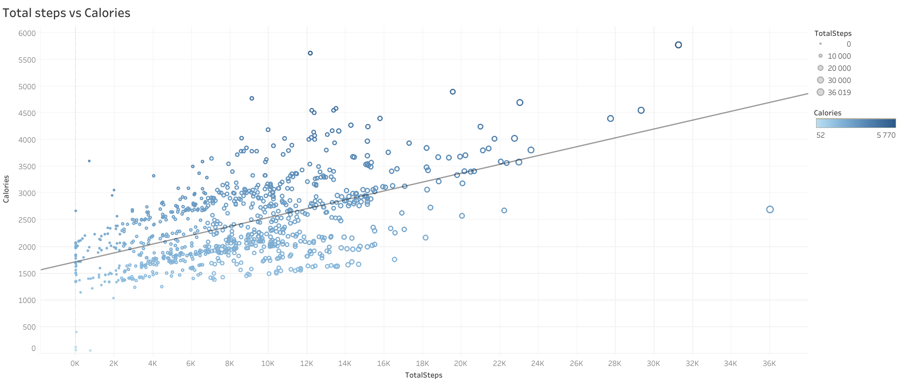
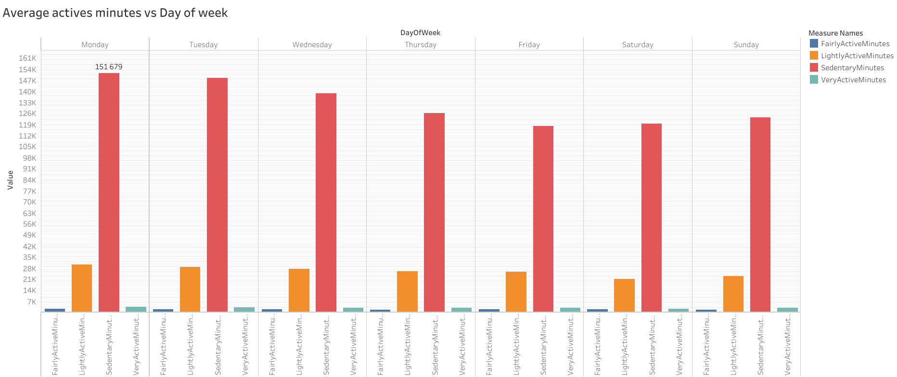
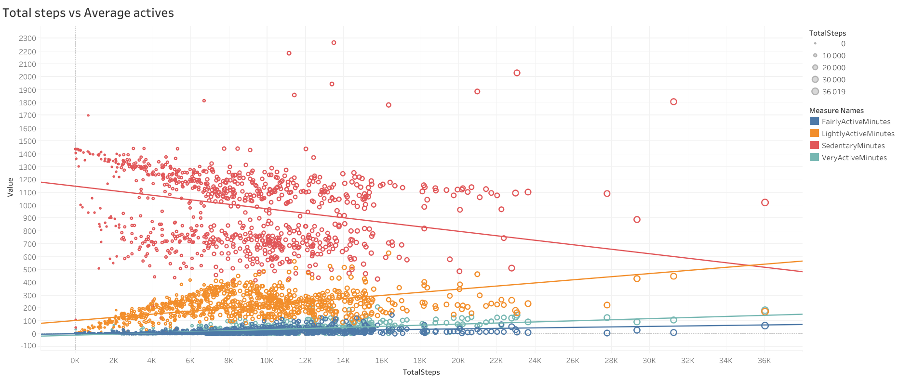
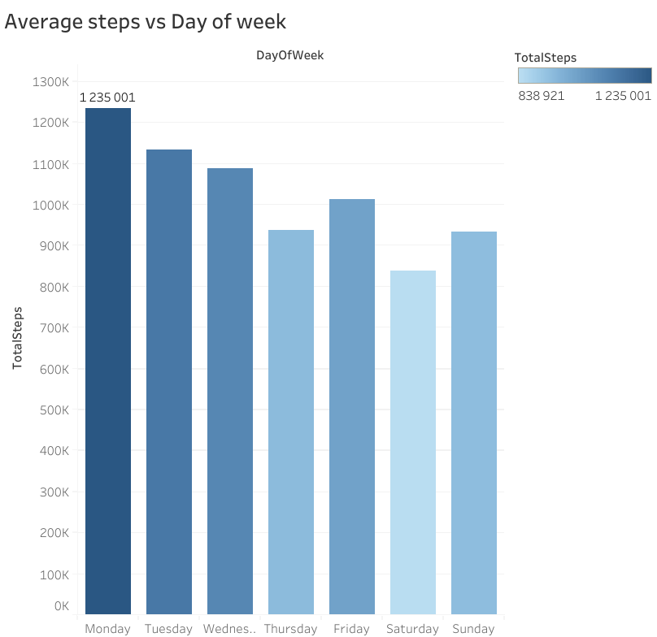
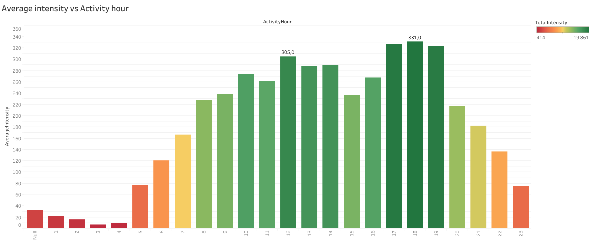
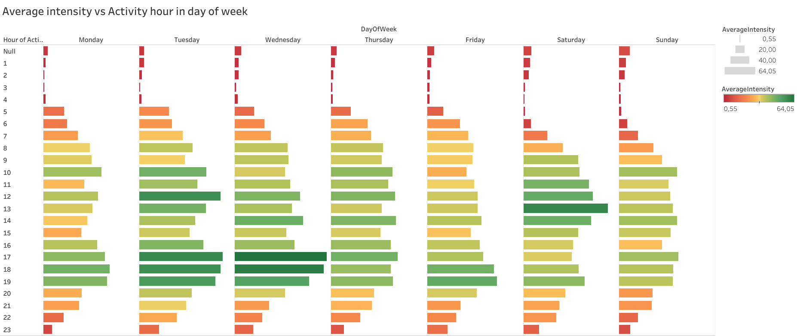

# bellabeat_project
## About the company 
Urška Sršen and Sando Mur founded Bellabeat, a high-tech company that manufactures health-focused smart products. Sršen used her background as an artist to develop beautifully designed technology that informs and inspires women around the world.

## Task
To analyze smart device usage data in order to gain insight into how consumers use non-Bellabeat smart devices
To select one Bellabeat product 
To apply insights in presentation. 

## Key stakeholders
UrškaSršen: Bellabeat’s cofounder and Chief Creative Officer 
SandoMur: Mathematician and Bellabeat’s cofounder; key member of the Bellabeat executive team 
Bellabeat marketing analytics team: A team of data analysts responsible for collecting, analyzing, and repo ing data that helps guide Bellabeat’s marketing strategy.

## Qestions
1. What are some trends in smart device usage? 
2. How could these trends apply to Bellabeat customers? 
3. How could these trends help in influence Bellabeat marketing strategy?

## Data sources used
Public data that explores smart device users’ daily habits. 
● FitBit Fitness Tracker Data (CC0: Public Domain, dataset made available through Mobius)
This Kaggle data set contains personal fitness tracker from thirty Fitbit users. Thirty eligible Fitbit users consented to the submission of personal tracker data, including minute-level output for physical activity, heart rate, and sleep monitoring. It includes information about daily activity, steps, and heart rate that can be used to explore users’ habits.
The data downloaded and stored on PC in archive.zip folder. 
Exported data organized in 2 folders: 
mturkfitbit_export_3.12.16-4.11.16 included 11 csv files
 
mturkfitbit_export_4.12.16-5.12.16. included 18 csv files
 

The data organized in wide format.

## ROCCC analysis for the FitBit Fitness Tracker data
**1. Reliability**
The data is obtained from the FitBit device, which is widely used for monitoring physical activity. However, there may be measurement errors due to sensor inaccuracies or incorrect device usage. It's also important to consider that the data may be incomplete due to missed days or lack of synchronization.  
**2. Originality**
The data is unique in the sense that it is collected individually for each user. It is primary data that has not undergone significant processing or transformation prior to publication. It is the primary data.  
**3. Comprehensiveness**
The data includes various aspects of physical activity, such as step count, heart rate, activity level, sleep, etc. However, it may lack important contextual information (e.g., users' health status or lifestyle), which could limit the depth of analysis.  
**4. Consistency**
The data is likely consistent in terms of time and format since it is automatically collected by the device. However, inconsistencies may arise due to missing data or changes in user behavior while wearing the device (e.g., if the user forgets to wear it).  
**5. Curation**
The data is available in its raw form, with minimal processing. This is good for maintaining originality but may require significant preprocessing and cleaning before analysis. It is important to account for possible data gaps and anomalies.  
**Conclusion:**
FitBit Fitness Tracker data represents a unique and reliable source of information on users' physical activity. However, to obtain accurate results, careful data cleaning is necessary, along with consideration of possible measurement errors and contextual limitations.  

 When working with FitBit Fitness Tracker Data, it is crucial to address several key aspects, including licensing, privacy, security, accessibility, and data integrity.

### Actions:
**Addressing Licensing:** attributed the source of the data appropriately in documentation.  
**Addressing Privacy:** implemented anonymization techniques, such as removing user IDs or aggregating data, to ensure that individual users cannot be identified from the dataset.  
**Addressing Security:** stored the data in secure, encrypted environments with access controls in place. Used secure methods for transferring data and ensured that any sharing of data is done in compliance with security protocols.  
**Addressing Accessibility:**  offered the data in multiple formats (e.g., CSV, Excel) and ensured that tools used for analysis are compliant with accessibility standards, such as WCAG (Web Content Accessibility Guidelines).  
**Verifying Data Integrity:** implemented data validation procedures, such as checking for missing values, duplicates, and outliers. Used checksum or hash functions to ensure that data has not been altered during transfer. Cross-validate with other data sources or documentation to confirm accuracy.  

## Tehnology used
**R:** "tidyverse", "here", "janitor", "lubridate", "skimr", "readr", "dplyr"  
**Tableau:** visualisations

## Project stracture
```bash
bellabeat_project/

├── README.md            # project description  
├── data/                # data fils (CSV)  
├── reports/             # RMarkdown and HTML reports  
├── visualizations/      # visaulisations    
```
## Data Insights

### 1. The correlation between the number of steps and the calories burned by the users. 
Analysis reveals a positive correlation between the number of steps taken and calories burned. The more active the user, the higher the calorie expenditure.

[View on Tableau Public](https://public.tableau.com/views/Bellabeat_viz_17327147322200/STEPSvsCOLORIES_1)



### 2. Activity Trends Across Days of the Week.
Sedentary activity dominates overall, peaking on Mondays (151,679 minutes) and reaching its lowest on Fridays. Other activity types follow a similar weekly pattern.  

[View on Tableau Public](https://public.tableau.com/views/Bellabeat_viz_17327147322200/Sheet2)


### 3. Correlation Between Steps and Activity Types.
A negative trend is observed for sedentary activity, meaning that more steps result in fewer sedentary minutes. In contrast, lightly active, fairly active, and highly active trends are positive, indicating that higher-intensity activities require less time to accumulate steps.  

[View on Tableau Public](https://public.tableau.com/views/Bellabeat_viz_17327147322200/STEPSvsCOLORIES)


### 4. Steps Count Across the Week.
Step count is highest on Mondays (1,235,001 steps) and gradually declines throughout the week. A slight increase occurs on Fridays, while the lowest step counts are observed on weekends, likely due to reduced work-related movement.  

[View on Tableau Public](https://public.tableau.com/views/Bellabeat_viz_17327147322200/STEPSvsDAYofWEEK)  


### 5. Activity Levels by Hour of the Day.
The most active period spans from 8 AM to 8 PM, with peak activity occurring during lunch breaks (12 PM) and after work (5-7 PM).  

[View on Tableau Public](https://public.tableau.com/views/Bellabeat_viz_17327147322200/Sheet5)  


### 6. Hourly Activity Patterns on Weekends vs. Weekdays.
On weekends, activity levels shift, with increased movement from midnight to 3 AM and reduced engagement between 5 PM and 7 PM.  

[View on Tableau Public](https://public.tableau.com/views/Bellabeat_viz_17327147322200/INTENSITYvsACTIVETYhOURinWEEK)  


## Recommendations

It’s important to emphasize that the collected data is from a limited sample, and the demographic information of the users is not taken into account.  

**Recommendations for Bellabeat based on data analysis**

**1. Smart Activity Reminders** Bellabeat can send users reminders during peak activity hours. If the daily calorie goal has not yet been reached, the app will encourage additional exercise, helping users stay in shape.  
**2. Personalized Sleep Recommendations** Based on the user’s average wake-up time, Bellabeat can suggest the optimal bedtime. These personalized notifications will help improve sleep quality and maintain energy levels throughout the day.  
**3. Flexible Workout Programs** Bellabeat can adapt workouts to users’ lifestyles. For example, it could suggest lighter exercises on weekdays and more intense workouts on weekends. This approach allows users to maintain regular physical activity while considering their schedules and preferences.  
**4. Gamification for Motivation** To increase engagement, Bellabeat can introduce an achievement system: the more goals (daily, weekly, monthly) a user reaches, the more points they earn. These points can be redeemed for discounts on sports products and other valuable rewards, making fitness a fun and rewarding experience.  
**5. Personalized Reports and Analytics Developing** an app with detailed reports and analytical tools will allow users to better understand their progress and receive personalized recommendations to achieve their goals.  
**6. Customized Nutrition and Workout Plans** Bellabeat can create personalized nutrition and workout plans based on user data. Diet and activity levels will be automatically adjusted according to daily physical activity, helping users maintain balance and achieve their fitness goals.  
**7. Partnerships for a Healthier Lifestyle**Developing partnership programs with fitness clubs, dance studios, and nutritionists. User data from devices will help partners create personalized and more effective programs for their clients, promoting a healthy lifestyle.  

